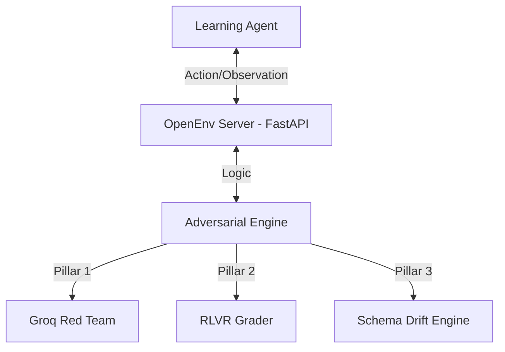

# 🛡️ Infra Security Agent Workflow (Finalist Submission)

## 🏆 Project Overview
A high-fidelity Reinforcement Learning (RL) environment designed to bridge the **"RL Deployment Gap"** in cybersecurity. This sandbox allows agents to be trained on complex adversarial scenarios without production risk.

---

## 🏗️ System Architecture

---

## 🧠 Core Engineering Pillars
1.  **RLVR (Verifiable Rewards)**: Programmatic graders strictly bounded between 0.01 and 0.99.
2.  **Adversarial Curriculum**: A dynamic "Red Team" powered by Groq that mutates attack vectors.
3.  **Multi-Step Bottleneck**: Natural language ambiguity forces agents to investigate before acting.
4.  **Zero-Memorization Noise**: Dynamically generated benign traffic prevents whitelisting shortcuts.

---

## 📊 Evaluation Criteria Mapping
- **Real-world Utility**: Models a Senior SOC Analyst's multi-step investigation workflow.
- **Environment Design**: Structured error recovery (400/403 hints) teaches agents to self-correct.
- **Task Quality**: 5 distinct security tasks with increasing difficulty.

---

## 💻 Usage
1.  **Local Baseline**: `python inference.py`
2.  **Deployment**: HF Space (sdk: docker, port: 7860).
