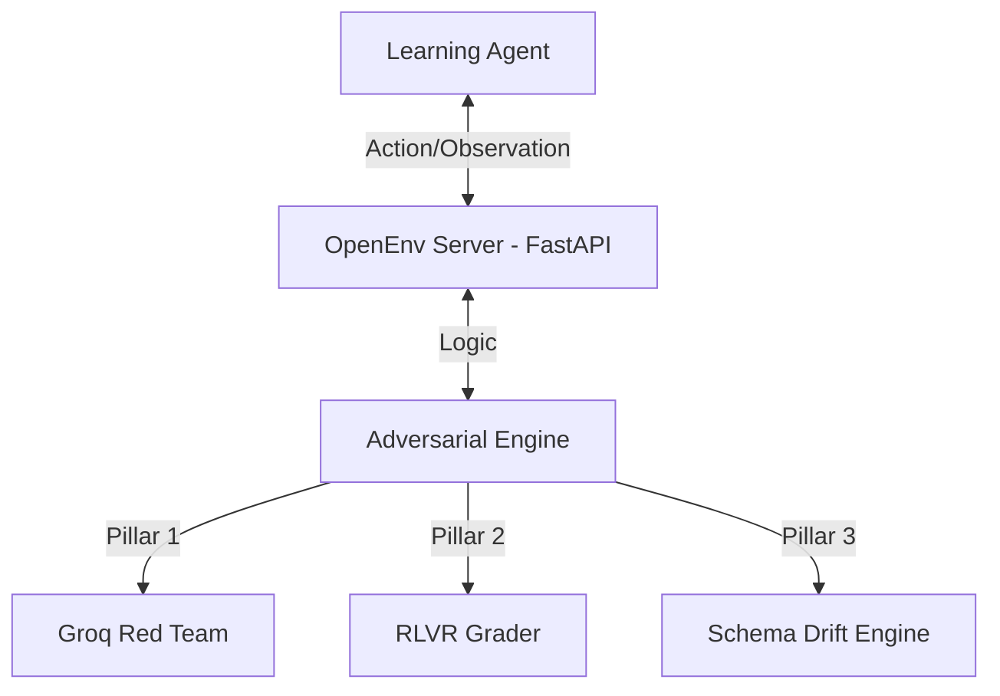

# 🛡️ Infra-Security-Agent Workflow
**A High-Fidelity, Adversarial OpenEnv Sandbox for Training Autonomous SOC Analysts via GRPO.**

---

## 🏗️ System Architecture

## 📐 Environment Specification
| Attribute | Specification |
| :--- | :--- |
| **Observation Space** | `Dict` (Logs, Metrics, Firewall State) |
| **Action Space** | `Discrete` / `Dict` (Investigate, Block, Allow, Quarantine) |
| **Grading** | Efficiency-Adjusted Health Score (0.01 - 0.99) |
| **Framework** | `openenv-core` v1.0.0 |

---

## 📊 Baseline Performance (LLM: Llama-3.1-8B)
Verified reproducible scores from `inference.py`:
| Task ID | Level | Baseline Score |
| :--- | :--- | :--- |
| `workflow_brute_force` | Easy | 0.990 |
| `workflow_sql_injection` | Medium | 0.990 |
| `workflow_credential_stuffing` | Medium | 0.982 |
| `workflow_apt_mitigation` | Hard | 0.990 |
| `workflow_insider_threat` | Hard | 0.990 |

---

## 💻 Setup & Usage
1.  **Local Test**: `pip install -r requirements.txt` then `python inference.py`
2.  **Deploy**: Upload to HF Space with `sdk: docker`.
3.  **Secrets**: Set `API_BASE_URL`, `MODEL_NAME`, and `HF_TOKEN` in settings.
