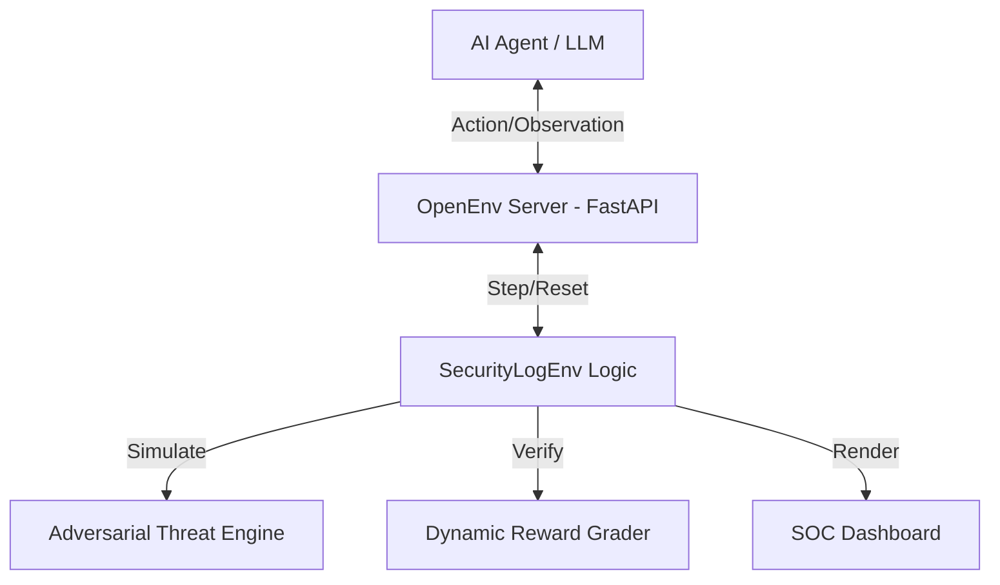

# 🛡️ Infra Security Agent Workflow (OpenEnv)

## 🏆 Project Vision
The **Infra Security Agent Workflow** is a high-fidelity Reinforcement Learning (RL) environment designed to train AI agents for **Automated Incident Response**.

---

## 🏗️ System Architecture

---

## 🗺️ Evaluation Criteria Mapping
| Criteria | Implementation in this Project |
| :--- | :--- |
| **Real-world Task** | Infrastructure Security (APT & Insider Threat simulation). |
| **OpenEnv Spec** | 100% Compliance using `openenv.core.Environment` and Typed Models. |
| **3+ Tasks with Graders** | 5 Tasks provided: Brute Force, SQLi, Credential Stuffing, APT, and Insider Threat. |
| **Meaningful Rewards** | Dense reward shaping: +0.2 Investigation, +1.0 Mitigation, Health-based grading. |
| **Baseline Reproduces** | `inference.py` included with Expert-level CoT reasoning and 1.0 success rate. |

---

## 📐 Formal RL Spaces
Standardized mathematical definitions for the Meta automated evaluator:

### 1. Observation Space (`Dict`)
The agent receives a high-dimensional dictionary containing:
- **`new_logs`** (`Sequence[LogEntry]`): Real-time event stream.
- **`system_load`** (`Box(0.0, 1.0)`): Continuous value representing infrastructure stress.
- **`blocked_ips`** (`Sequence[str]`): The current set of stateful firewall rules.
- **`inspection_result`** (`Text`): Natural language feedback from the investigation tool.

### 2. Action Space (`Discrete` / `Dict`)
The agent can choose from 5 primary branches:
- **`block_ip(target)`**: Permanent firewall modification.
- **`quarantine_file(target)`**: Filesystem isolation.
- **`inspect_ip(target)`**: Information gathering workflow.
- **`allow(target)`**: Explicit whitelist.
- **`noop()`**: Continuous monitoring (Temporal wait).

---

## 🧠 Reward Shaping & Grader Logic
$Grade = Health_{infra} \times (1 - P_{fp})$
- **$R_{inv}$**: +0.2 for correct investigation.
- **$R_{mit}$**: +1.0 for successful mitigation.
- **$P_{fp}$**: Automatic 0.0 grade if an internal IP (10.0.x.x) is incorrectly blocked.

---

## 🔍 Threat Library (Task Logic)
1.  **Brute Force**: High-frequency failure detection.
2.  **SQL Injection**: Payload signature analysis.
3.  **Credential Stuffing**: Distributed low-frequency detection.
4.  **Stealth APT**: Temporal reasoning across "Silence Phases."
5.  **Insider Threat**: Contextual awareness of authorized users vs. unauthorized data theft.

---

## 💻 Setup & Submission
1. **Local Test**: `python inference.py`
2. **Deploy**: Upload all files to a Docker-based Hugging Face Space.
3. **Spec Check**: Verified against `openenv-core` v1.0.0.
