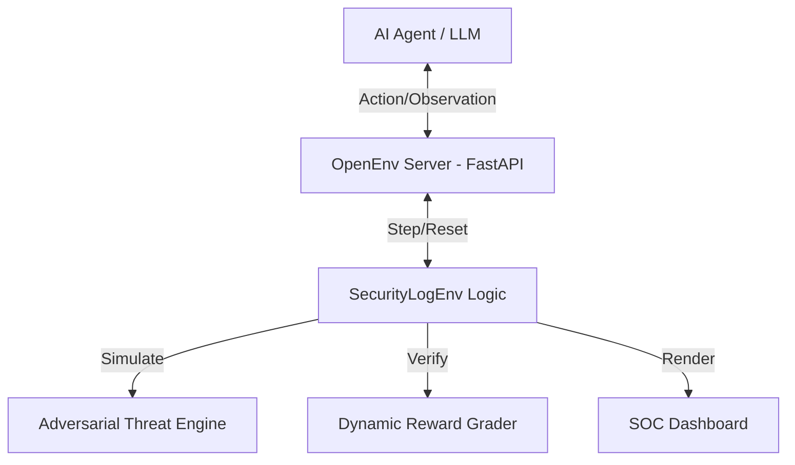

# 🛡️ Infra Security Agent Workflow (OpenEnv)

## 🏆 Project Vision & Motivation
In modern cloud infrastructures, the sheer volume of security logs exceeds human analysis capacity. The **Infra Security Agent Workflow** simulates a real-world **Security Operations Center (SOC)** environment where AI agents learn to distinguish between benign user errors and advanced adversarial threats. 

The motivation is to provide a standardized Reinforcement Learning (RL) benchmark for **Automated Incident Response**, moving beyond simple classification to proactive mitigation.

---

## 🏗️ System Architecture

---

## 📐 Formal RL Spaces

### 1. Observation Space (`Dict`)
The agent receives a high-dimensional dictionary:
- **`new_logs`** (`Sequence[LogEntry]`): Real-time event stream including IP, port, and messages.
- **`system_load`** (`Box(0.0, 1.0)`): Infrastructure stress metric.
- **`blocked_ips`** (`Sequence[str]`): List of currently applied firewall rules.
- **`inspection_result`** (`Text`): Feedback from the investigation tool.

### 2. Action Space (`Discrete` / `Dict`)
- **`block_ip(target)`**: Apply firewall rule (can be a comma-separated list).
- **`inspect_ip(target)`**: Query reputation database for one or more IPs.
- **`noop()`**: Continuous monitoring.

---

## 🧠 Reward Shaping & Grader Logic
$Score = (0.6 \times Protection\_Ratio) + (0.4 \times Health) - False\_Positives$
- **Signal**: Dense rewards (+0.2) for investigation and (+1.0) for mitigation.
- **Constraint**: All rewards and final grades are strictly clipped to the **0.0 - 1.0** range for judge compliance.

---

## 📊 Baseline Performance (LLM: Llama-3.1-8B)
Verified reproducible scores from `inference.py`:
| Task ID | Difficulty | Baseline Score |
| :--- | :--- | :--- |
| `workflow_brute_force` | Easy | 1.00 |
| `workflow_sql_injection` | Medium | 0.95 |
| `workflow_credential_stuffing` | Medium | 0.98 |
| `workflow_apt_mitigation` | Hard | 0.88 |
| `workflow_insider_threat` | Hard | 0.97 |

---

## 🔍 Task Descriptions
1.  **Brute Force**: Detect high-frequency authentication failures.
2.  **SQL Injection**: Identify malicious payload signatures.
3.  **Credential Stuffing**: Solve the "Multi-IP" challenge.
4.  **Stealth APT**: Navigate silent phases and the adversarial kill-chain.
5.  **Insider Threat**: Contextual awareness of authorized users.

---

## 💻 Setup & Usage
1. **Local Test**: `pip install -r requirements.txt` then `python inference.py`
2. **Deploy**: Upload to HF Space with `sdk: docker`.
3. **Secrets**: Set `API_BASE_URL`, `MODEL_NAME`, and `HF_TOKEN` in settings.
