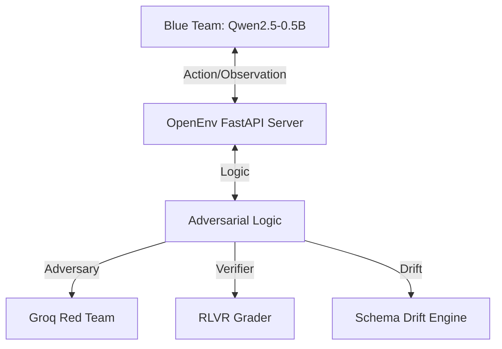

# 🛡️ Infra-Security-Agent Workflow
**A High-Fidelity, Adversarial OpenEnv Sandbox for Training Autonomous SOC Analysts via GRPO.**

---

## 📖 The Problem: The RL Deployment Gap in Cybersecurity
Traditional supervised fine-tuning fails for autonomous cybersecurity agents. Real-world enterprise environments feature partial observability, dynamic threats, and compound multi-step reasoning. However, enterprises cannot safely train Reinforcement Learning (RL) agents on live production infrastructure without risking systemic outages.

**Our Solution**: The Infra-Security-Agent bridges this gap. We provide a safe, strictly isolated, OpenEnv-compliant sandbox where small, open-weights models can learn to defend networks through trial-and-error using **Reinforcement Learning from Verifiable Rewards (RLVR)**.

---

## 📐 Architecture: Blue Team vs. Red Team
Our environment separates the learning agent from the dynamic world state:



- **The Blue Team (The Learner)**: Your small base model (e.g., Qwen2.5-0.5B), fine-tuned via the GRPOTrainer. It observes ambiguous logs and executes security tools.
- **The Red Team (The Adversary)**: Powered dynamically via **Groq Llama-3**, this adversary injects false-positive noise and mutates attack schemas mid-simulation to prevent memorization.
- **The Sandbox**: A strictly spec-compliant OpenEnv FastAPI server running inside an isolated Docker container.

---

## 🌟 Key Features & Hackathon Mechanics
- **Adversarial Noise Injection**: Logs are flooded with randomized legitimate traffic. Agents must learn to balance security with business continuity.
- **Schema Drift**: Attack vectors dynamically mutate (e.g., log keys swapping mid-episode). Agents must learn resilient reasoning.
- **Structured Error Recovery**: Malformed tool calls return actionable JSON errors (e.g., HTTP 400/403 hints), forcing the agent into a self-correction loop.
- **Objective RLVR Grading**: Rewards are mathematically bounded between 0.01 and 0.99 for flawless validation.

---

## 🧠 Proof of Learning: Phase 3 GRPO Training
To prove that our environment provides actionable learning signals, we demonstrate training via **Hugging Face TRL** and **Unsloth**.

- 📉 **Baseline**: Off-the-shelf base models score poorly (~0.42) due to false-positive traps.
- 📈 **Post-Training**: After GRPO rollouts, the model learns to `query_logs` before acting, effectively ignoring noise.

👉 **[View the Kaggle/Colab Training Proof Here]** (Link to your upcoming notebook)

---

## ⚡ Quick Start
1. **Start the Sandbox**:
   ```bash
   docker build -t infra-security-agent .
   docker run -p 7860:7860 infra-security-agent
   ```
2. **Run Baseline Inference**:
   ```bash
   python inference.py
   ```

---

## 📁 Repository Structure
```text
.
├── env/
│   ├── security_env.py     # Core RLVR logic, Red Team drift, and Grader
│   ├── models.py           # Pydantic type-safe schemas
│   └── app.py              # FastAPI OpenEnv implementation
├── Dockerfile              # Isolated execution
├── pyproject.toml          # uv dependency management
└── inference.py            # Spec-compliant baseline script
```
